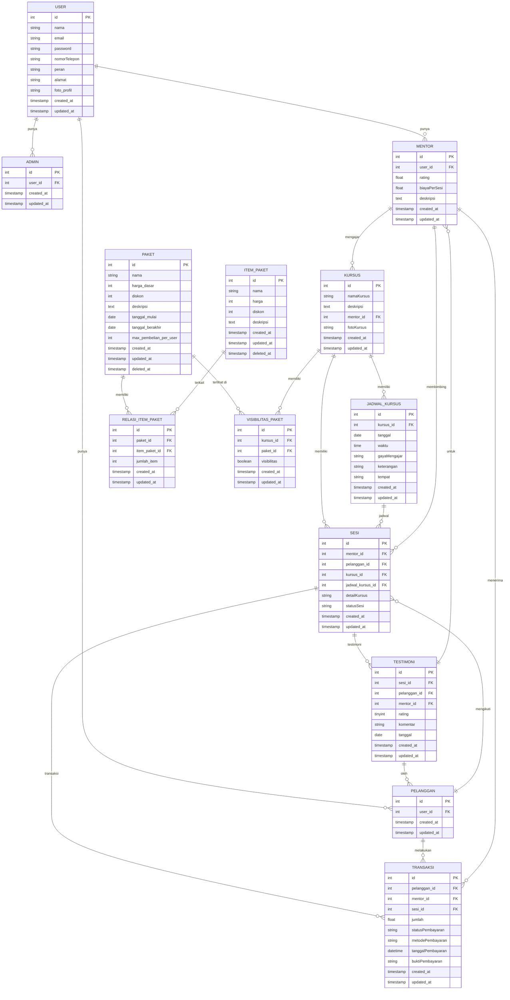

# ERD Keseluruhan Sistem

Berikut adalah ERD keseluruhan (utama) dalam format Mermaid agar mudah dibaca di markdown:

---

> Diagram ini bisa di-render otomatis di VS Code atau GitHub jika ekstensi Mermaid diaktifkan. Relasi dan field utama sudah disesuaikan dengan skema migrasi yang ada.
