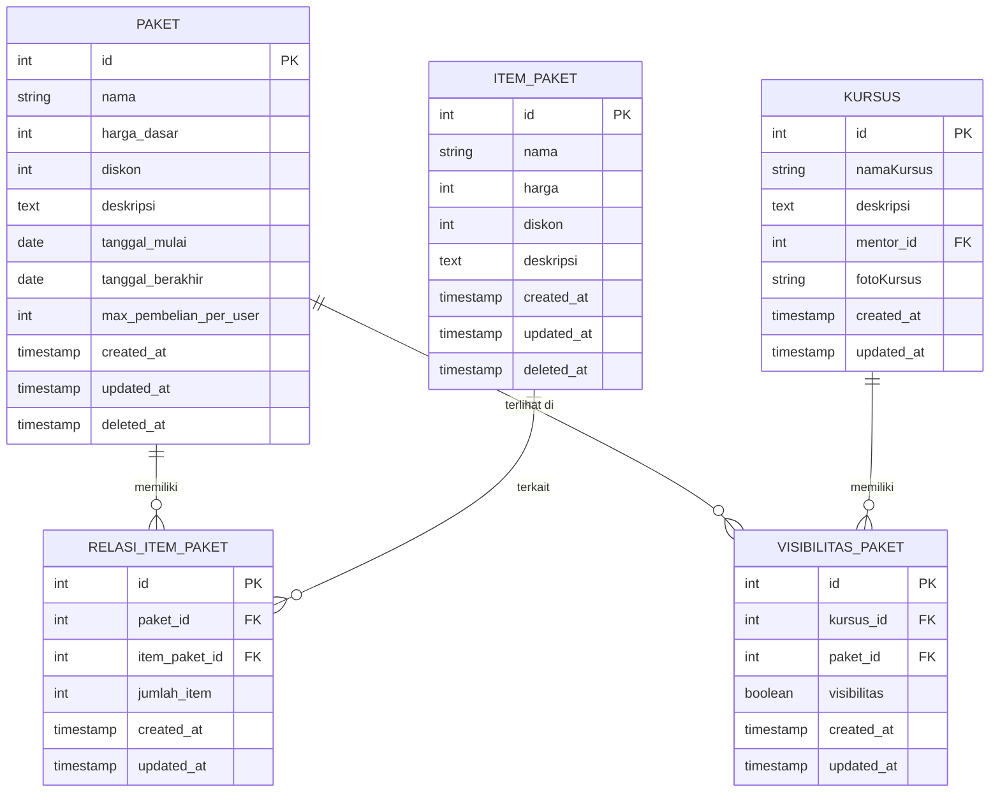

# ERD Fitur Paket

Berikut adalah Entity Relationship Diagram (ERD) dalam format teks untuk fitur paket:

---

- **PAKET**: Data utama paket.
- **ITEM_PAKET**: Item yang bisa masuk ke dalam paket.
- **RELASI_ITEM_PAKET**: Relasi many-to-many antara paket dan item_paket, dengan atribut tambahan.
- **VISIBILITAS_PAKET**: Relasi paket dengan kursus, mengatur visibilitas paket di kursus tertentu.
- **KURSUS**: Tabel kursus (hanya ditampilkan relasinya).

> Diagram ini bisa di-render otomatis di VS Code atau GitHub jika ekstensi Mermaid diaktifkan.
